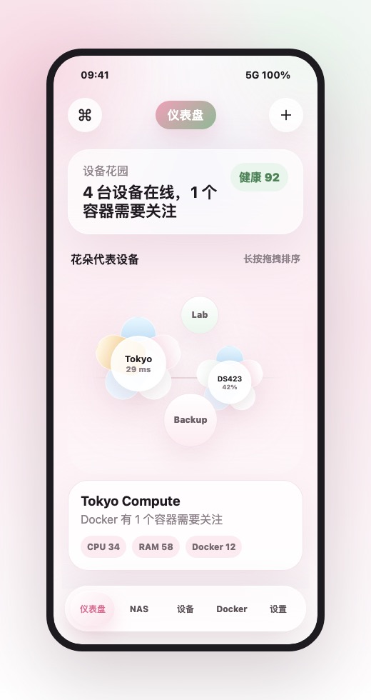
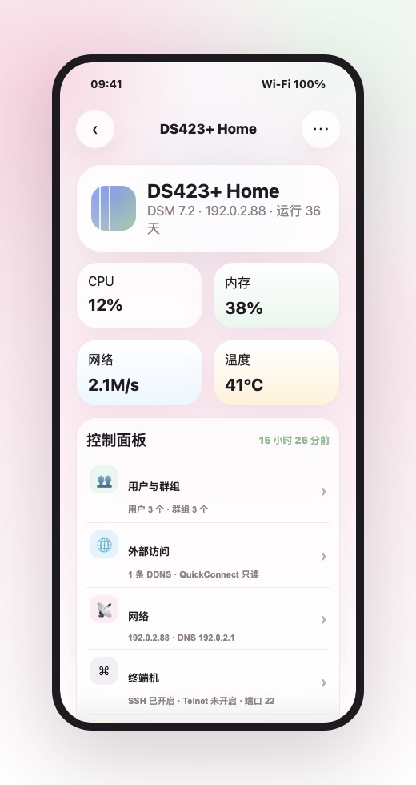
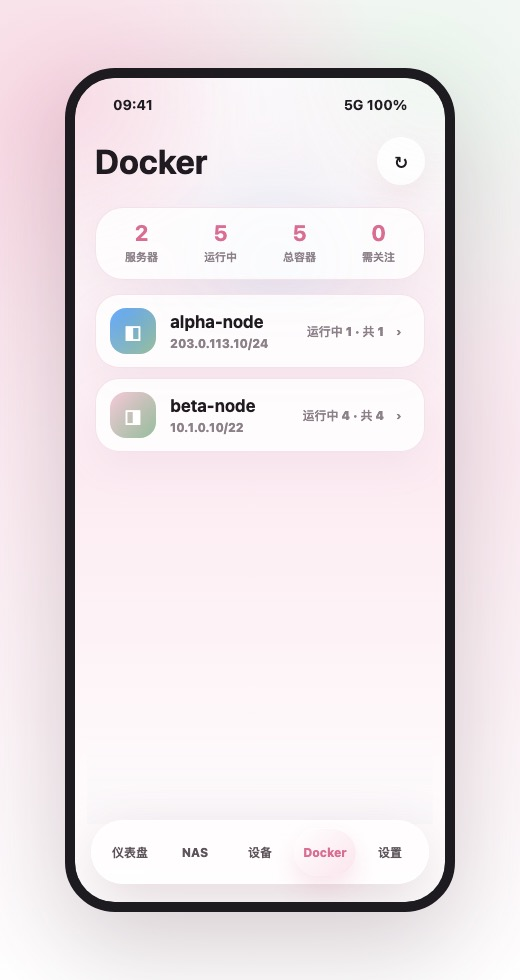

# Servera

[中文](#中文) | [English](#english)

## 中文

Servera 是一款用 SwiftUI 写的 iOS 运维管理 App，目标是把 SSH 服务器、群晖 NAS、Docker 容器和常用控制面板能力放进一个轻量、好看的移动端工具里。

| Server 首页 | NAS 管理 | Docker 管理 |
| --- | --- | --- |
|  |  |  |

> 截图来自 iPhone 17 模拟器和项目原型图。真实运行截图中涉及服务器地址的内容已避免直接公开。

### 模块状态

| 模块 | 当前状态 | 说明 |
| --- | --- | --- |
| Server 首页 | 已完成 | SSH 服务器列表、星群入口、排序、刷新、进入详情。 |
| Server 详情 | 已完成 | CPU、内存、网络、硬盘、运行时间、进程、Docker 摘要。 |
| SSH 终端 | 已完成 | 交互式 SSH 终端、命令历史、断开重连。 |
| 设备添加/编辑 | 已完成 | SSH Server / 群晖 NAS 添加编辑、Host Key 确认、Keychain 凭据保存。 |
| NAS 首页/详情 | 已完成 | DSM 状态、资源指标、存储空间、控制面板入口、Docker 入口。 |
| NAS 文件管理 | 已完成 | 浏览、上传、同名覆盖确认、新建文件夹、重命名、删除、下载分享。 |
| NAS Docker | 已完成 | 容器列表、详情、启动、停止、重启、删除、日志、刷新；NAS Docker 保持免费。 |
| NAS 控制面板 | 部分完成 | 用户与群组、外部访问、网络/代理、终端机、信息中心已接入；部分 DSM 写接口仍需更多版本实测。 |
| Server Docker | 部分完成 | 只展示服务器 Docker，支持二级容器管理、状态、日志、启动/停止/重启/刷新；正式版收费边界还没最终收口。 |
| 设置与备份 | 部分完成 | 设备配置加密导入/导出已接入；iCloud 同步、正式 Pro 订阅还没完成。 |
| 收费功能 / Pro | 未完成 | 目前只有 Pro 展示和文案雏形，没有接入真实内购、订阅校验或服务端授权。 |
| Docker 高级管理 | 未完成 | 还没有镜像管理、Compose、创建容器、编辑端口/卷/环境变量。 |
| 发布配置 | 未完成 | App Store 图标、隐私说明、正式签名、上架配置还没收口。 |

### 当前状态

当前验证：

- iPhone 17 模拟器构建、安装、启动通过。
- iOS generic build 通过。
- 当前 XCTest 12 个用例通过。
- 原型图、开发文档、运行截图已放入仓库内。

收费功能说明：

- 现在没有完成真实收费系统。
- `Servera Pro` 相关内容主要是 UI 展示和产品边界预留。
- 没有接入 StoreKit 内购、订阅恢复、收据校验、服务端授权。
- NAS 管理、NAS 文件、NAS Docker 当前按免费能力设计。

### 运行环境

- macOS：当前测试环境为 **macOS 26.5**
- Xcode：当前测试环境为 **Xcode 26.5**
- iOS Deployment Target：**iOS 18.0+**
- Swift：**Swift 6**
- 模拟器：**iPhone 17 / iOS 26.5**

### 如何运行

1. 用 Xcode 打开：

   ```sh
   open Servera.xcodeproj
   ```

2. 选择 `Servera` scheme。
3. 选择 iPhone 模拟器，直接 Run。
4. 真机运行时需要在 Xcode 里选择你自己的 Team，并确保 Bundle Identifier 可签名。

项目依赖的 SSH 包 `Traversio` 已放在 `Packages/Traversio`，拉下来后不需要额外安装 CocoaPods 或 Carthage。

### 验证命令

```sh
xcodebuild -project Servera.xcodeproj -scheme Servera -destination 'generic/platform=iOS' build
xcodebuild -project Servera.xcodeproj -scheme Servera -destination 'platform=iOS Simulator,name=iPhone 17' test
```

当前维护环境中：

- 模拟器：构建、安装、启动、测试通过。
- 真机：iOS generic 签名构建通过；真机运行需使用自己的开发者账号重新签名。

### 文档与原型

- 开发文档：[`Docs/PR/iOS服务器监控SSH终端App开发文档.md`](Docs/PR/iOS服务器监控SSH终端App开发文档.md)
- 原型图目录：[`Docs/YX`](Docs/YX)
- README 截图目录：[`Docs/Screenshots`](Docs/Screenshots)

### 说明

Servera 目前还处在产品化开发阶段，适合学习 SwiftUI、SSH/NAS/Docker 管理链路，或作为自用运维工具继续二次开发。涉及真实服务器、NAS 网络配置、用户账号、Docker 容器删除等操作时，请先在测试设备上验证。

## English

Servera is an iOS operations app built with SwiftUI. It brings SSH servers, Synology NAS, Docker containers, and common control-panel tasks into one lightweight and polished mobile tool.

| Server Home | NAS Management | Docker Management |
| --- | --- | --- |
|  |  |  |

> Screenshots are from an iPhone 17 Simulator and project prototypes. Sensitive server addresses are not exposed in the README.

### Module Status

| Module | Status | Notes |
| --- | --- | --- |
| Server Home | Done | SSH server list, star-cluster entry, ordering, refresh, and detail navigation. |
| Server Detail | Done | CPU, memory, network, disk, uptime, processes, and Docker summary. |
| SSH Terminal | Done | Interactive SSH terminal, command history, reconnect flow. |
| Device Add/Edit | Done | SSH Server / Synology NAS add and edit, Host Key confirmation, Keychain credential storage. |
| NAS Home/Detail | Done | DSM status, resource metrics, storage overview, Control Panel entry, Docker entry. |
| NAS File Manager | Done | Browse, upload, overwrite confirmation, create folder, rename, delete, and share download. |
| NAS Docker | Done | Container list, detail, start, stop, restart, delete, logs, and refresh. NAS Docker is designed as a free feature. |
| NAS Control Panel | Partially Done | Users/groups, external access, network/proxy, terminal, and information center are wired. Some DSM write APIs still need broader version testing. |
| Server Docker | Partially Done | Server-only Docker index, second-level container management, status, logs, start/stop/restart/refresh. Production paywall boundary is not finalized. |
| Settings and Backup | Partially Done | Encrypted import/export is wired. iCloud sync and production Pro subscription are not finished. |
| Paid Features / Pro | Not Done | Pro UI and product boundary placeholders exist, but real in-app purchase, subscription validation, receipt checking, and server authorization are not implemented. |
| Advanced Docker | Not Done | No image management, Compose, container creation, or port/volume/env editing yet. |
| Release Setup | Not Done | App Store icon, privacy copy, final signing, and release configuration are not finalized. |

### Current Status

Current verification:

- iPhone 17 Simulator build, install, and launch passed.
- iOS generic build passed.
- Current XCTest suite passes 12 tests.
- Prototypes, development notes, and screenshots are included in this repository.

Paid features:

- A real paid feature system is not implemented yet.
- `Servera Pro` is currently mostly UI presentation and product-boundary preparation.
- StoreKit purchase, subscription restore, receipt validation, and server-side authorization are not wired.
- NAS management, NAS files, and NAS Docker are currently designed as free features.

### Requirements

- macOS: tested on **macOS 26.5**
- Xcode: tested on **Xcode 26.5**
- iOS Deployment Target: **iOS 18.0+**
- Swift: **Swift 6**
- Simulator: **iPhone 17 / iOS 26.5**

### Run Locally

1. Open the project in Xcode:

   ```sh
   open Servera.xcodeproj
   ```

2. Select the `Servera` scheme.
3. Choose an iPhone Simulator and press Run.
4. For a real device, select your own Team in Xcode and make sure the Bundle Identifier can be signed.

The SSH dependency `Traversio` is vendored under `Packages/Traversio`. No CocoaPods or Carthage setup is required.

### Verification

```sh
xcodebuild -project Servera.xcodeproj -scheme Servera -destination 'generic/platform=iOS' build
xcodebuild -project Servera.xcodeproj -scheme Servera -destination 'platform=iOS Simulator,name=iPhone 17' test
```

Current maintainer environment:

- Simulator: build, install, launch, and tests passed.
- Real device: iOS generic signed build passed; running on your own device requires your own developer signing.

### Docs And Prototypes

- Development notes: [`Docs/PR/iOS服务器监控SSH终端App开发文档.md`](Docs/PR/iOS服务器监控SSH终端App开发文档.md)
- Prototype screens: [`Docs/YX`](Docs/YX)
- README screenshots: [`Docs/Screenshots`](Docs/Screenshots)

### Note

Servera is still being productized. It is suitable for learning SwiftUI, SSH/NAS/Docker management flows, or continuing as a personal operations tool. For destructive or high-risk operations such as changing NAS network settings, user accounts, or deleting Docker containers, test on safe devices first.
